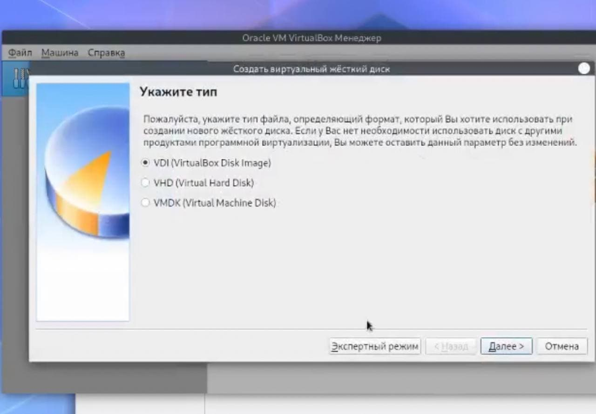

---
## Front matter
lang: ru-RU
title: Лабораторная работа №1. Установка и конфигурация операционной системы на виртуальную машину.
author: Захарова Софья Михайловна

## Formatting
toc: false
slide_level: 2
theme: metropolis
mainfont: PT Serif 
romanfont: PT Serif
sansfont: PT Sans
monofont: PT Mono
header-includes: 
 - \metroset{progressbar=frametitle,sectionpage=progressbar,numbering=fraction}
 - '\makeatletter'
 - '\beamer@ignorenonframefalse'
 - '\makeatother'
aspectratio: 43
section-titles: true
---
# Цель работы

Приобретение практических навыков установки операционной системы на виртуальную машину, настройки минимально необходимых для дальнейшей работы сервисов.

---
# Задание

Лабораторная работа подразумевает установку на виртуальную машину VirtualBox операционной системы
Linux, дистрибутив Centos.

---
# Выполнение лабораторной работы

1. Заходим в терминал, в каталог /var/tmp, создаем каталог smzakharova1 для дальнейшей работы, перейти в общий каталог, где размещён образ виртуальной машины.

{ #fig:001 width=50% }

---

2. Копируем образ в каталог, созданный на предыдущем шаге.

{ #fig:002 width=50% }

---

3. Заходим в VB Менеджер и создаем виртуальную машину Base с типом Linux версией Red Hat(64-bit)

{ #fig:003 width=50% }

---

4. Указываем объем памяти - 1024 МБ.

{ #fig:004 width=50% }

---

5. Выбираем новый виртуальный жесткий диск.

{ #fig:005 width=50% }

---

6. Указываем тип: VDI.

{ #fig:006 width=50% }

---

7. Указываем формат хранения.

{ #fig:007 width=50% }

---

8. Указываем имя и размер файла.

{ #fig:008 width=50% }

---

9. Устанавливаем папку для снимков.

{ #fig:009 width=50% }

---

10. Устанавливаем носитель.

{ #fig:010 width=50% }

---

11. Запускаем виртуальную машину Base и устанавливаем язык.

{ #fig:011 width=50% }

---

12. Устанавливаем дату и время.

{ #fig:012 width=50% }

---

13. Раскладку клавиатуры меняем на русскую.

{ #fig:013 width=50% }

---

14. Устанавливаем сервер с GUI и дополнения "средства разработки".

{ #fig:014 width=50% }

---

15. Выбираем нужное устройство.

{ #fig:015 width=50% }

---

16. Меняем сеть и имя узла.

{ #fig:016 width=50% }

---

17. Задаем пароль.

{ #fig:017 width=50% }

---

18. Вводим имя пользователя для дальнейшей работы и вводим пароль.

{ #fig:018 width=50% }

---

19. Принимаем лицензионное соглашение.

{ #fig:019 width=50% }

---

20. Сеть и имя узла установлены на предыдущих шагах, оставляем неизменными.

{ #fig:020 width=50% }

---

21. Заходим под своим профилем, вводим пароль от учетной записи.

{ #fig:021 width=50% }

---

22. Переходим под учетную запись root в терминале с помощью команды su, Обновляем системные файлы и устанавливаем необходимые программы.

{ #fig:022 width=50% }

---

23. Заходим в менеджер виртуальных носителей и освобождаем жесткий диск, изменяем атрибуты носителя на множественное подключение.

{ #fig:023 width=50% }

---
# Выводы

В ходе работы мы установили операционную систему на виртуальную машину, настроили минимально необходимые для дальнейшей работы сервисы.

---

## {.standout}

Спасибо за внимание!
